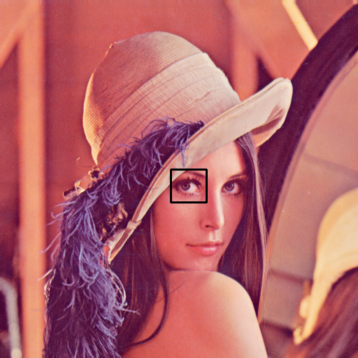

# cvtemp

Rust-OpenCV bounded together to do template matching, thing

## Sample Usage

Template matching is to find where some portion (needle) of a image (haystack) is

| Haystack                      | Needle                            | Match                           |
|:------------------------------|:----------------------------------|:--------------------------------|
|     |     |     |
|  |  |  |

You can reproduce the examples by running
```shell
git clone https://github.com/zhufucdev/cvtemp.git
cd cvtemp
cargo run -- -o -t 0.99 ./sample/host.png ./sample/target.png ./sample/match.png
```

## Credits

[](https://github.com/twistedfall/opencv-rust)